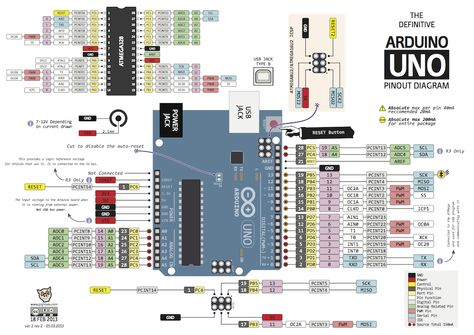

# Programar Para Educar

## Curso del CEP de Granada

## Enero de 2016

[Calendario](./Indice.md)

### José Antonio Vacas @javacasm

# Arduino

## Así lo vemos nosotros

[más detalle](imagenes/ArduinoUno_R3_Front.jpg)

## Así es internamente
#### (mucho por descubrir)

* * *

# Para hacer un proyecto necesitamos:

* ### Programa

* ### Montaje

#### (descargar el programa en la placa)

#### [Instalación del IDE de arduino](http://www.slideshare.net/javacasm/32-instalacin-del-ide)
