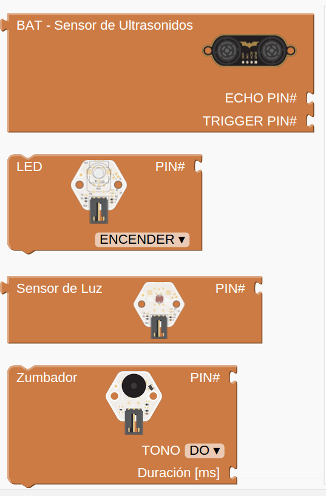
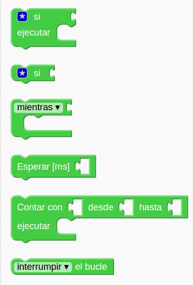
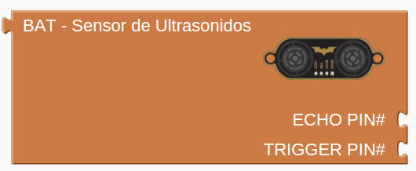
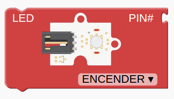
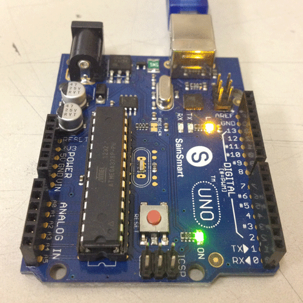
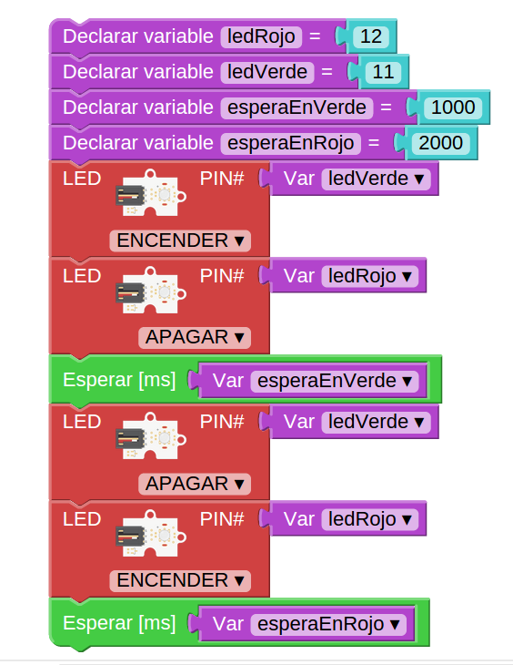
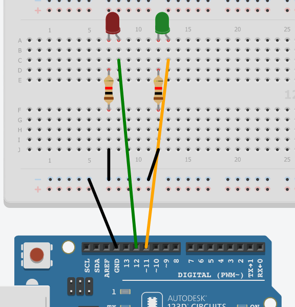

# Programar Para Educar

## Curso del CEP de Granada

## Enero de 2016

[Calendario](./Indice.md)

### José Antonio Vacas @javacasm

# Programando con Bitbloq

### http://bitbloq.bq.com

Bitbloq es un entorno de programación visual que nos permite hacer pogramas para Arduino sin tener conocimientos de programación.

Un programa estará formado un conjunto de bloques que encajan entre sí.

Los bloques están agrupados en familias, cada una de ellas con un color concreto.

Existen 2 tipos de bloques:

* Los que llevan asociado un componente electrónico. Entre los primeros están todos los incluidos los bloques de las familias **Octupus** o **Zum** o la familia de los Servos. En ellos están los típicos bloques **Led**, **Pulsador**, **Potenciómetro**, **Sensor de luz**, etc.
	Todos estos bloques necesitan que les asignemos un pin de la placa que será al que estén conectados y que incluiremos en el conector **#PIN**.

* Los bloques de programación son los que nos permiten decidir el modo en el que se ejecuta nuestro programa, haciendo que una parte se repita un número de veces o dependiendo del estado de un sensor se ejecute o no un grupo de instrucciones. En la imagen estamos viendo los bloques de control para hacer esperas o bucles.

Todos los bloques tienen unos conectores que encajan entre sí y que nos permiten conectarlos a los demás. Los conectores superior e inferior nos permiten establecer el orden en el que ejecutarán.

Los conectores laterales de la derecha o izquierda nos dicen si el bloque necesita una información o si la proporciona.

Así, los bloques que tiene un conector a la izquierda saliente nos proporcionan una información: un valor si es una constante, la lectura de un sensor, etc. En la imagen se ve un sensor de ultrasonidos que nos proporciona información de distancia hasta un obstáculo.

Los que tienen un conector entrante a la derecha necesitan de esa información para funcionar. Por ejemplo todos los bloques de hardware tienen al menos un conector porque necesitan un pin de la placa al que conectarse

* * *

## Programa parpadeo

Vamos a utilizar algunos de estos bloques para hacer un programa sencillo que haga parpadear un led.

#### Programa parpadeo (blink)

* Encendemos
* Esperamos
* Apagamos
* Esperamos
* Volvemos al principio

Vemos que hemos utilizado 2 bloques Led, no hay que entender que se necesitan 2 leds, si no que le damos 2 órdenes distintas (encender y apagar)

* * *

### Usaremos el led interno

#### Ejercicio: Cambiar la velocidad de parpadeo

* * *

## Con led externo

### Montaje sencillo

[detalle led](imagenes/300px-LED.png)

* * *
### Montaje con placa prototipo

[¿cómo funciona una placa prototipo?](imagenes/breadboard1.gif)

#### Ejercicio: Cambiar el pin utilizado al pin 2

* * *

### Esquema eléctrico

* * *

## Con un relé usaremos ¡¡grandes corrientes eléctricas!!

#### Ejercicio: Cambiar al pin del esquema

* * *
## Veamos un poco de código

	void setup()  				// Función de configuración
	{
	  pinMode(13,OUTPUT);  		// Vamos a usar una salida
	}

	void loop()  // Función de bucle. Se repite por siempre
	{
	  digitalWrite(13,HIGH);  	// Activamos la salida 13
	  delay(1000);				// Esperamos
	  digitalWrite(13,LOW);		// Desativamos la salida 13
	  delay(1000);				// Esperamos
	}							// Cuando termina se vuelve a llamar

#### Ejercicio: Cambiar al pin del esquema
#### Ejercicio: Cambiar el pin utilizado al pin 2

* * *
## Semáforo

2 leds (rojo y verde) se alternan con un tiempo de espera entre ellos

Como queremos que el código sea claro usaremos una variable para indicar el pin al que está conectado cada led.

* LED Rojo encendido y Verde apagado
* Esperamos un tiempo (EsperaEnRojo)
* LED Rojo apagado y Verde encendido
* Esperamos un tiempo (EsperaEnVerde)

* * *

## Semáforo con bitbloq

* * *
## Semáforo con código

	setup()
	{ pinMode(ledverde,OUTPUT);
	  pinMode(ledrojo,OUTPUT);
	}

	void loop()
	{ int esperaVerde=1000;
	  int esperaRojo=500;
	  digitalWrite(ledverde,LOW);
	  digitalWrite(ledrojo,HIGH);
	  delay(esperaVerde);
	  digitalWrite(ledrojo,LOW);
	  digitalWrite(ledverde,HIGH);
	  delay(esperaRojo);
	}

* * *
## Montaje semáforo

* * *
