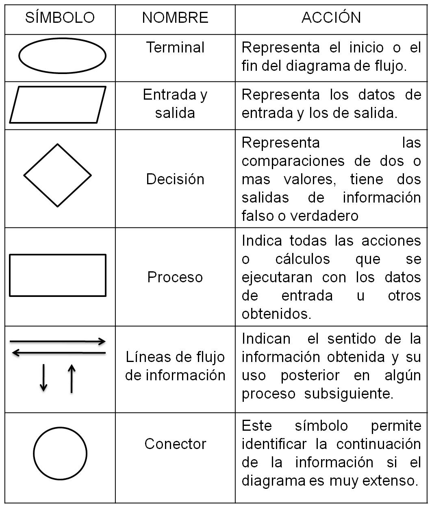

# Programar Para Educar

## Curso del CEP de Granada

## Enero de 2016

[Calendario](./Indice.md)

### José Antonio Vacas @javacasm

# ¿Qué es un algoritmo?

## Un conjunto de instrucciones ordenadas y finitas, que nos van a permitir realizar una activad mediante pasos sucesivos

Los algoritmos ...
* Permiten modelar procesos físicos complejos (gases)
* Simular procesos (péndulo)
* No sólo existen dentro de los ordenadores (atarse los zapatos, receta de cocina, planning de las vacaciones,...)
* No sólo se aplican a problemas matemáticos

Pensamiento Algoritmico es una manera de pensar orientado a resolver problemas

* Formulación, modelización y simulación de problemas reales
* Identitificación, testeo e implementación de soluciones
* Generalización y aplicación de soluciones propuestas situaciones reales

Nos va a permitir realizar también actividades creativas, a expresarnos

* Contando historias (Haciendo animaciones  o creando películas)
* Creando juegos
* Desarrollando nuestras habilidades
* Potenciando la creatividad

## Potenciaremos

* Confianza en el manejo de la complejidad
* Perseverancia para trabajar con problemas difíciles y no estructurados
* Tolerancia a la ambigüedad
* Capacidad para comunicarse y trabajar en equipo

### ¿Qué es un programa?

#### Programa parpadeo (blink)

* Encendemos
* Esperamos
* Apagamos
* Esperamos
* Volvemos al principio

¿Qué necesitamos?

* Algo que encender
* Algo que mida el tiempo

## Podemos representar un algoritmo usando diagramas de flujo

#### ¿Por qué es importante dibujar antes de programar?

#### A partir del esquema será mucho más fácil "escribir" el programa.

## ¿Cuál entorno elegir?

[Buena Guía](http://programamos.es/reyes-magos-ideas-regalos-programacion-robotica-navidades/)

## Uso

* Sencillez de uso y que sea intuitivo ... aplicaciones web
* Facilidad de uso ... ratón
* Facilidad de compartir proyectos ... comunidad integrada
* Gran número de ejemplos
* Documentación abundante y simple
* Comunidad activa y accesible

[>> Bloques](./Bloques.md)
