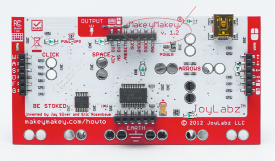
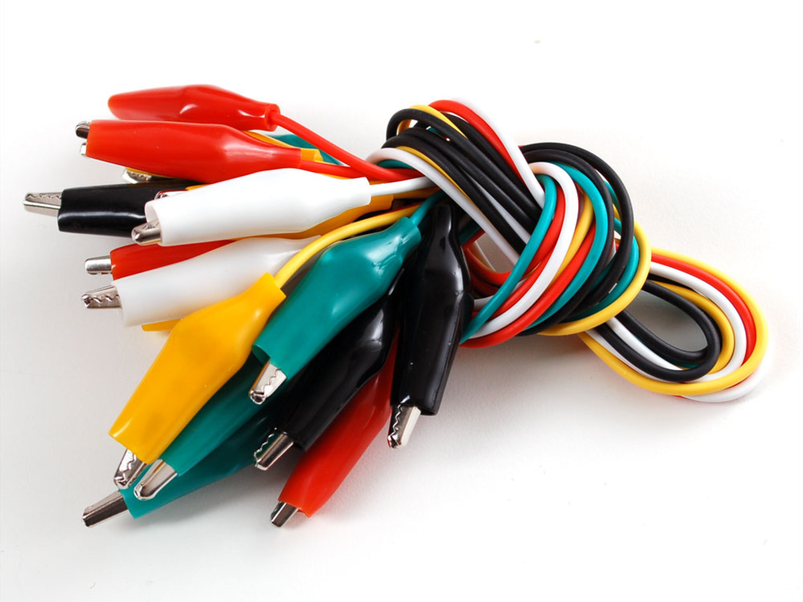

# Programar Para Educar

## Curso del./imagenes/ CEP de Granada(

## Enero de 2016

[Calendario](./Indice.md)

### José Antonio Vacas @javacasm

# [Makey Makey](http://www.makeymakey.com/)

Surgió de un proyecto de KickStarted

* ¿Cuanto cuesta? - 50€

* ¿Qué es? Sacar de [aquí](https://lilydev.wordpress.com/2013/04/16/the-awesomeness-of-makey-makey/)

Por delante

Por detrás

## ¿Cómo funciona?

# Referencias

[Lecciones](http://makeymakey.com/lessons/)
