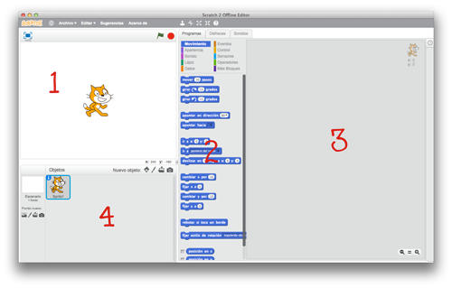
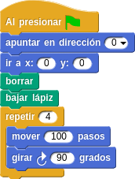
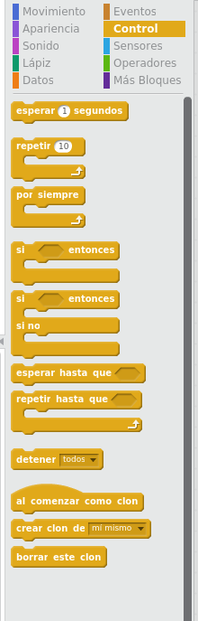

# Programar Para Educar

## Curso del CEP de Granada

## Enero de 2016
(12,14,19,21,26 y 28 de Enero de 2016)

[Calendario](./Indice.md)

### José Antonio Vacas @javacasm

# [Scratch](https://scratch.mit.edu/)

### Es un entorno de programación creado en el **MIT** por [Mitchel Resnick](https://www.media.mit.edu/people/mres)
([A Different Approach to Coding](https://medium.com/bright/a-different-approach-to-coding-d679b06d83a#.734u3gfm8) y [su mágnifica charla TED](https://www.ted.com/talks/mitch_resnick_let_s_teach_kids_to_code?language=es))

Podemos usarlo desde [acceso web](https://scratch.mit.edu/projects/editor) y como [aplicación de escritorio](https://scratch.mit.edu/scratch2download/).

Usa tecnología propietaria de Adobe (Flash), por lo podría no funcionar en todos los dispositivos

Existe una enorme [comunidad](https://scratch.mit.edu/starter_projects/)

## Interface

## Bloques

* Movimiento
* Apariencia
* Sonidos
* Lápiz
* Datos
* Eventos
* Control
* Sensores
* Operadores
* Más bloques

## Formas de los bloques

## Puntos de partida

## ¡¡Vamos a dibujar!!

### Es un sistema pensado para ser muy adaptable

### Por eso tenemos que dar todos los pasos

### Tendremos que decir cuando usamos el lapiz y donde empezamos a dibujar

## Cuadrado

### Vamos a dibujar un cuadrado

### Tenemos claros los pasos:
	1. Línea
	2. Giro
	3. Línea
	4. Giro
	5. Línea
	6. Giro
	7. Línea
	8. Giro

### ¡¡Pero podemos hacerlo más fácil
	Vamos a repetir 4 veces:
		1. Línea
		2. Giro

* * *

### ¿ Y si hacemos más de 4 giros?

### ¿Y si repetimos muchos cuadrados?

## Variables

### Nos permiten almacenar valores que pueden cambiar

# Tarea 0: rehacer el dibujo del polígono definiendo variables

### Podemos definir las variables para decidir el flujo de ejecución

# Tarea 1: Utilizando líneas haz un programa que permita dibujar un poligono según una variable con su número de lados

## Sentencias de Control

### Condicionales

## Moviéndonos por la pantalla

## personaje

Un mismo personaje puede tener varios disfraces

### Cada uno lleva su propio programa

### Pueden interaccionar

## Las coordenadas son unas "variables especiales"

* Vamos a mover un personaje por la pantalla
* Usaremos las teclas (sensores y condicionales)

# Tarea 3: Crear una animación de un personaje que se mueva con las teclas

## Creando nuestros propios bloques (objetos)

### Scratch nos permite definir nuevos bloques

## Ejemplos

[tutoriales de dsigno](http://programamos.es/creando-un-videojuego-paso-a-paso-con-scratch-desde-cero/)

[libro virtual sobre scratch](http://www.tallertecno.com/libro.html#scratch)

[Tutorial básico sobre movimiento de personajes](http://programamos.es/creando-un-videojuego-paso-a-paso-con-scratch-desde-cero/)

## Referencias

[cursos](http://paunin.blogspot.com.es/2015/11/quieres-aprender-scratch.html)

[MOOC UOC](https://mooc.scratch.uoc.edu/courses/course-v1:UOCx+UOC002+015_T1/info)

[Aprendiendo Scratch desde 0](http://programamos.es/creando-un-videojuego-paso-a-paso-con-scratch-desde-cero/)

[Presentación Scratch](http://www.slideshare.net/josepujolperez/introduccion-a-scratch)

[Tutoriales](http://www.educaciontrespuntocero.com/recursos/el-proyecto-scratch-de-los-viernes-i-moviendo-el-gato/29934.html)

[>> Alternativas a Scratch (Snap)](./Snap.md)
