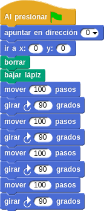

# Programar Para Educar

## Curso del CEP de Granada

## Enero de 2016

[Calendario](./Indice.md)

### José Antonio Vacas @javacasm

Snap

Es una alternativa a [Scratch](./Scratch.md)

Los bloques son compatibles

Usa 100% open source

### Es un sistema pensado para ser muy adaptable

### Por eso tenemos que dar todos los pasos

### Tendremos que decir cuando usamos el lapiz y donde empezamos a dibujar

* * *

## Cuadrado

### Vamos a dibujar un cuadrado

### Tenemos claros los pasos:
	1. Línea
	2. Giro
	3. Línea
	4. Giro
	5. Línea
	6. Giro
	7. Línea
	8. Giro

### ¡¡Pero podemos hacerlo más fácil
	Vamos a repetir 4 veces:
		1. Línea
		2. Giro

* * *

### ¿ Y si hacemos más de 4 giros?

### ¿Y si repetimos muchos cuadrados?

